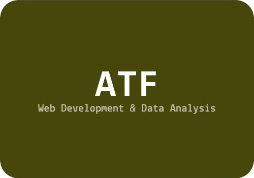
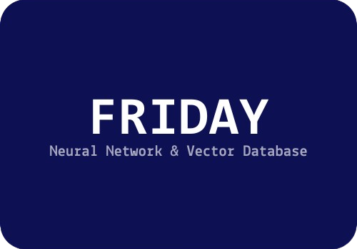
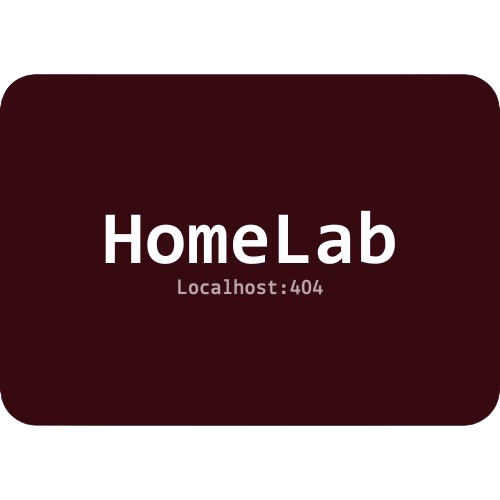
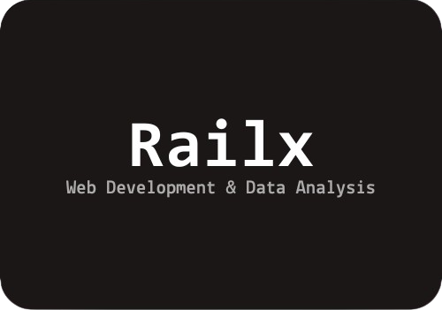

<h1> Hey! Nice meet You.</h1>

Hi, I'm <strong>Yashvardhan.</strong> 
Full Stack Developer focused on Python, scalable backends, and applied AI solutions.

<h3>Things I code with</h3>

<h3>My Experimentals</h3>
<table width="100%" border="0" cellpadding="0" cellspacing="0" style="border:none;">
<tr>

<td width="50%" valign="top" style="border:none;">
 

 
<strong>AUTO-APPLY</strong> - GitHub 
Python, Selenium, SQL, Olama Developed an Al-based application that
automatica ly searches and applies for relevant job openings on platforms like LinkedIn and Naukri. The system
generates customized, ATS-friendly resumes and cover letters using LLMs and maintains application records in a
SQL database.
 
 

 
<strong>Friday & Cortana Lite</strong> - GitHub 
Built Friday & Cortana Lite for Power Grid Corporation of India Ltd., developing AI-driven web and desktop tools to handle large volumes of documents, automate workflows, and enable easy data access for non-technical users.
 
 

 
<strong> ATF & Tender Hunt</strong> - GitHub 
Tender Hunt and ATF automate tender searches, streamlining employee tasks. ATF scans 12 websites, like Gem and Coal India. Tender Hunt, the project's front end, uses HTML, CSS, and JavaScript for a user-friendly interface. It lets employees set criteria, boosting overall user experience.
 
 

</td>

<td width="50%" valign="top" style="border:none;">
 

 
<strong>Smart Store System</strong> - GitHub 
This project is a comprehensive Smart Store System that uses a Python-based backend and a web-based frontend for managing inventory, enhancing user experience, and simplifying payment processes. The system is designed to automate store-side operations and offer customers a seamless shopping experience with minimal manual intervention
 
 

 
<strong>HomeLab</strong> - GitHub 
I built a self-hosted server environment to deploy, test, and manage applications locally in a production-like setup. I configured custom local domains, reverse proxy routing, and HTTPS certificates to securely host multiple internal services and dashboards. The lab serves as a sandbox for experimenting with automation scripts, web apps, networking configurations, and system deployments, helping me gain hands-on expergience with real-world infrastructure and DevOps practices.
 
 

 
<strong>Railway Management System</strong> - GitHub 
About The Railway Management System, also known as RailX, was developed during my 6th semester in college as part of the Software Project Management (SPM) course. Despite being a mini-project, IT IS LICENSE WITH NPOL.
 
 

</td>

</tr>
</table>
